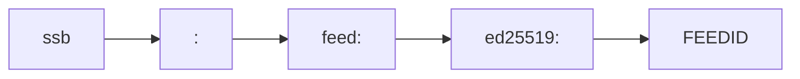

# Proposal

## Extend `ssb-uri` to add query-only addresses


### Diagrams



```mermaid
graph LR
    ssb --> :
	: --> feed: --> ed25519: --> feedid[<FEEDID>]
	: --> message: --> sha256one[sha256:] --> msgid[<MSGID>]
	: --> blob: --> sha256two[sha256:] --> blobid[<BLOBID>]
	: --> ?
	? --> msaddr= --> msex[<MSADDRESS>]
```

### Summary

**Content** URIs follow `ssb-uri` unmodified.

**Multiserver addresses** use the `msaddr` query parameter where the value `<MSADDRESS>` a [multiserver address](https://github.com/ssbc/multiserver-address) escaped as URI-safe characters:

```
ssb:?msaddr=<MSADDRESS>
```

And other parameters:

- `inviteType`
- `inviteCode`

```
ssb:?msaddr=<MSADDRESS>&inviteType=<TYPE>&inviteCode=<CODE>
```

- `alias`
- `roomId`
- `userId`
- `signature`

```
ssb:?msaddr=<MSADDRESS>&alias=<ALIAS>&roomId=<RID>&userId=<UID>&signature=<SIG>
```

**Action** URIs use the `action` query parameter:

- `http-auth-start`

```
ssb:?action=http-auth-start&sid=<SID>&sc=<SC>
```

- `publish-vote`

```
ssb:message:sha256:g3hPVPDEO1Aj\_uPl0-J2NlhFB2bbFLIHlty-YuqFZ3w=?action=publish-vote&expression=yup
```

### Examples

- `ssb:message:sha256:g3hPVPDEO1Aj\_uPl0-J2NlhFB2bbFLIHlty-YuqFZ3w=`
- `ssb:feed:ed25519:-oaWWDs8g73EZFUMfW37R\_ULtFEjwKN\_DczvdYihjbU=`
- `ssb:blob:sha256:sbBmsB7XWvmIzkBzreYcuzPpLtpeCMDIs6n\_OJGSC1U=`
- `ssb:?msaddr=net%3A88.198.115.222%3A8008~shs%3Aim4Qn0fCzpD3YfsegHFLJzkNXYUb%2FnYnlfuCf%2BLmPuM%3D`

### Verdict

Would be backwards compatible with `ssb-uri` while allowing easy extensibility.